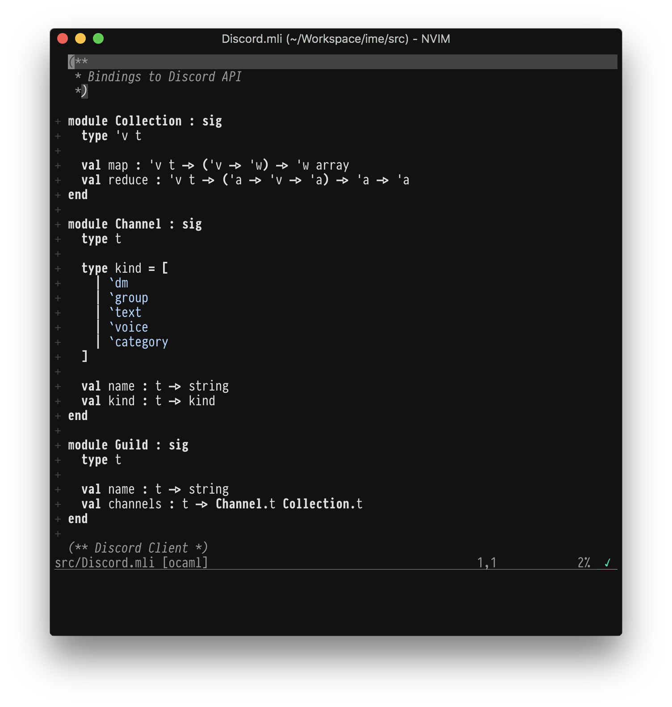
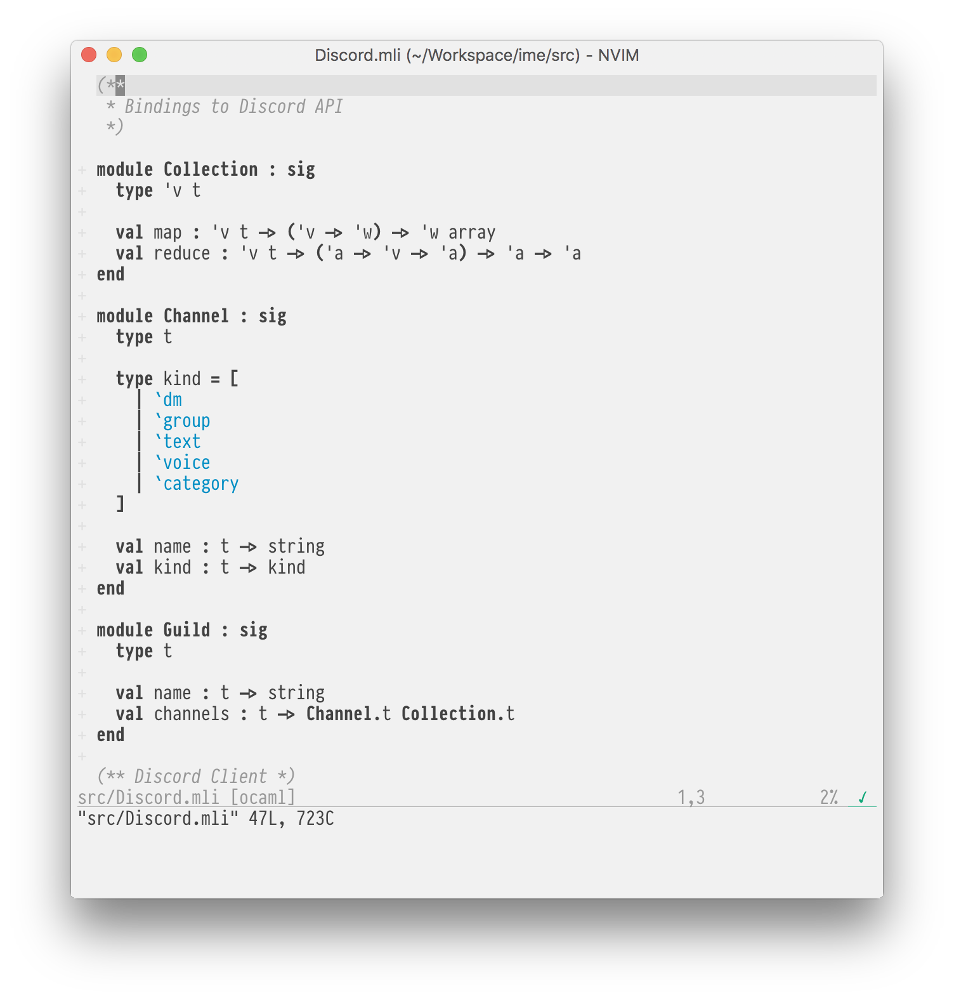

# vim-colors-plain

This is a fork of [vim-colors-off][] which is being developed based on my
personal taste.




## Installation & Usage

With [vim-plug][] you add this to the `.vimrc`:

```
Plug 'andreypopp/vim-colors-plain'
```

Then:

```
set background=light " Set to dark for a dark variant
colorscheme plain
```

[vim-colors-off]: https://github.com/pbrisbin/vim-colors-off
[vim-plug]: https://github.com/junegunn/vim-plug
